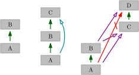
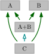
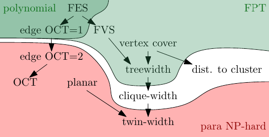

# HOPS Documentation

This website uses several things that deserve to be explained in detail.

* [Legend for diagrams](./legend/)
* [Website controls](./controls/)
* [Intro to relevant complexity theory](./complexity/)

## Structure of HOPS

This website contains a collection of parameters, some relevant graph classes, their relations, and sources which established the results.
One may view parameters in several different ways, making the terminology little complicated -- let us first introduce these viewpoints.

### Fixed graph view

If we take a fixed graph $G$, then we can measure value of various parameters on it.
In this view, we call a parameter $A$ "smaller" then $B$ if for any graph it is guaranteed that $A=f(B)$ for some computable function $f$.
We observe that it is not necessarily a smaller value, but the point is that $B$ bounds $A$ so $A$ cannot grow arbitrarily big while $B$ is not changing.

On this page, we depict smaller parameters as being (generally) the ones below.

### Graph class view

Each parameter can be thought of as a sequence of graph classes, one class for each value of the parameter.
Then the parameter relations are about inclusions of these sequences.
In other words, if we fix $k$ and take the class created by all graphs with parameter $A \le k$, is there some $f$ such that all graphs that have parameter $B \le f(k)$ is its graph superclass?
In some sense, this view fixes the parameters and compares sizes of respective graph classes.
Here, "smaller" could refer to the size of graph classes -- which is exactly the opposite direction of the "smaller" explained above.
To distringuish these two notions we call a smaller graph class to be more "restrictive" or "stronger" instead.

So more restrictive or strong parameters are generally bigger, less restrictive or weaker parameters are generally smaller.

## Relations among parameters and graphs

Having parameters $A$ and $B$, we say that $A$ upper bounds $B$ if for any instance that has $A \le k$ we know it has $B \le f(k)$ for some computable function $f$.
As parameters can be thought of as graph classes, for the purposes of the inference we consider graph classes to be trivial parameters whose class does not depend on the parameter.
Hence, if a parameter is fixed for a graph class, then we conclude $B \le O(1)$ for $A \le k$.

There are many diagrams that try to convey the parameter relations, read [the legend](./legend/) for notation.

### Inference of relations

Upper bound relation is reflexive and transitive, hence, we can serially compose the known upper bound relations.
The resulting function is the result of function composition, i.e., if $B \le f(A)$ and $C \le g(B)$, then $C \le g(f(A))$.
In the other direction, we may know that $A$ does NOT upper bounds $D$.
Because of transitivity this implies that if $B \le f(A)$ and $D \le f(C)$ while $D \not\le f(A)$, then we can infer $C \not\le f(A)$, $D \not\le f(B)$, and $C \not\le f(B)$.
Both of these inferences are shown in the following picture.

    

We see that showing the inferred relations in Hasse diagrams makes them harder to read so we hide those.
We also hide the incomparabilities as there is just too many of them.
Instead, all the pairwise relations are shown in separate relation tables.

Some parameters are defined as a combination of two other parameters, i.e., parameter $A+B$ means that both $A$ and $B$ are bounded.
We can easily infer that $A \le A+B$ and $B \le A+B$.
In this case, there is an inference that if $A \le C$ and $B \le C$ then $A+B \le 2C$ which makes the former relations transitive of the latter and can be hidden in the Hasse view, simplifying it.

    

## Refining complexity results and how does the hierarchy help

While having a problem in mind we can show it is either tractable or hard.
Diagrams in HOPS show how those results propagate.
Tractabilities propagate up while hardnesses propagate down.

For example, we observe that [maximum clique](../html/q7zHeT/) is upper bounded by [chromatic number](../html/w7MmyW/).
This means that all graphs with chromatic number $h$ have maximum clique at most $f(h)$ (in this specific case $f$ is known to be a linear function).
Notice that when we substitute a parameter for a computable function of the other parameter (substitute $h$ for $f(h)$) an algorithm that was FPT remains FPT, and an XP algorithm remains XP.
Hence, our tractability results automatically also work for any parameter that upper bounds maximum clique.
So to improve our results, we can now show that maximum clique problem remains W[1]-hard even when parameterized by chromatic number -- this result is indeed also known to be true.
A natural question now is: how far up can we push the hardness and how far down can we push tractability?
The following picture shows an example work-in-progress state for some problem.

    

