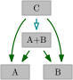

# HOPS Documentation

This website uses several things that deserve to be explained in detail.

* [Legend for website's graphical elements](./legend/)
* [Website controls](./controls/)
* [Intro to relevant complexity theory](./complexity/)
* [About the project](./about/)

## Structure of HOPS

This website contains a collection of parameters, some relevant graph classes, their relations, and sources which established the results.
As one may view parameters in several different ways let us introduce our viewpoint.

### Parameters

*Parameterized problem* is a decision problem along with a natural number *parameter*.
In our case, the input is a graph $G$ and parameter which tells us something about the graph -- e.g. size of its vertex cover.
Note that the input instance is not guaranteed to have the correct parameter value, e.g. the vertex cover parameter is way smaller than the actual vertex cover size.
However, for inputs with an incorrect parameter value we may return an incorrect answer; so we assume correct value and answer arbitrarily if along the way we reach a contradiction.

For the sake of simplicity, let us fix the parameter to be the vertex cover in the following discussion.
Any fixed graph $G$ has a fixed value of its minimum vertex cover.
We can extend this notion also to graph classes, saying that $\mathcal G$ has bounded vertex cover if there is a number $p$ such that all graphs $G \in \mathcal G$ have bounded vertex cover $vc(G) \le p$.
This relation can also be viewed from the other side -- fix value of a parameter $p$, and let $\mathcal G_p$ be all graphs with vertex cover at most $p$.
Naturally, this creates a sequence of graphs $\mathcal G_1,\mathcal G_2,\dots,\mathcal G_P$ where $P$ is maximal reasonable value (could be $\infty$).
For vertex cover, we observe that $\mathcal G_i \subseteq \mathcal G_{i+1}$ as bigger vertex cover is "stronger".
This relation is typical for parameters, however, is not necessarily required and it is feasible to have parameters that do not satisfy it, e.g. girth satisfies the inverse inclusion.

### Parameter relations

We say that a parameter $A$ is "smaller" than $B$ on a graph class $\mathcal G$ if $A(G) \le f(B(G))$ for every $G \in \mathcal G$ for some computable function $f$.
This is same as saying that if $B$ is bounded on $\mathcal G$, then $A$ is bounded on $\mathcal G$.
Usually, we consider $\mathcal G$ to be the graph class of bounded $A$, so the assumption is trivially true.
However, some parameters are defined well just for a fixed graph class and one cannot define a graph class that contains all elements with a bounded parameter value (e.g. [shrub-depth](/html/NTgNzT/)).

Observe that if $A$ is "smaller" than $B$ it does not mean that its value is smaller arithmetically.
The point is that bounded $B$ implies bounded $A$, so $A$ cannot grow arbitrarily big when $B$ is not changing.
On this page, we depict smaller parameters as being (generally) the ones on the bottom.

### Relations among parameters and graphs

As a degenerate case of parameter relations, we may consider $A$ to be a fixed graph class $\mathcal G$.
If $\mathcal G$ has bounded value of parameter $B$ then indeed $B \le f(A) = \text{constant}$.
On the other hand, we can show that a graph class contains a sequence of graphs where the parameter value grows arbitrarily high so the graph class has unbounded $A$.
This website contains diagrams that convey the graph-parameter relations, read [the legend](./legend/) for notation.

### Inference of relations

Upper bound relation is reflexive and transitive, hence, we can serially compose the known upper bound relations.
The resulting function is the result of function composition, i.e., if $B \le f(A)$ and $C \le g(B)$, then $C \le g(f(A))$.
In the other direction, we may know that $A$ does NOT upper bounds $D$.
Because of transitivity this implies that if $B \le f(A)$ and $D \le f(C)$ while $D \not\le f(A)$, then we can infer $C \not\le f(A)$, $D \not\le f(B)$, and $C \not\le f(B)$.
Both of these inferences are shown in the following picture.

    

Showing the inferred relations in Hasse diagrams makes them harder to read, so we hide the transitive relations.
We also hide the incomparabilities as there is just too many of them.
Instead, all the pairwise relations are shown in separate relation tables.

Some parameters are defined as a combination of two other parameters, i.e., parameter $A+B$ means that both $A$ and $B$ are bounded.
We can easily infer that $A \le A+B$ and $B \le A+B$.
In this case, there is an inference that if $A \le C$ and $B \le C$ then $A+B \le 2C$ which makes the former relations transitive of the latter and can be hidden in the Hasse view, simplifying it.

    

## Refining complexity results and how does the hierarchy help

While having a problem in mind we can show it is either tractable or hard.
Diagrams in HOPS show how those results propagate.
Tractabilities propagate up while hardnesses propagate down.

For example, we observe that [maximum clique](../html/q7zHeT/) is upper bounded by [chromatic number](../html/w7MmyW/).
This means that all graphs with chromatic number $h$ have maximum clique at most $f(h)$ (in this specific case $f$ is known to be a linear function).
Notice that when we substitute a parameter for a computable function of the other parameter (substitute $h$ for $f(h)$) an algorithm that was FPT remains FPT, and an XP algorithm remains XP.
Hence, our tractability results automatically also work for any parameter that upper bounds maximum clique.
So to improve our results, we can now show that maximum clique problem remains W[1]-hard even when parameterized by chromatic number -- this result is indeed also known to be true.
A natural question now is: how far up can we push the hardness and how far down can we push tractability?
The following picture shows an example work-in-progress state for some problem.

    

