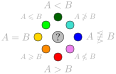

# Legend for website's graphical elements

## Hasse diagrams

The Hasse diagrams show partially ordered set of parameter inclusions.
Arrows that can be implied by other arrows are hidden for clarity.
Parameters are represented by boxes and relations between them are depicted by arrows.

**Parameter box** identifies a parameter by its most prominent name.
Alternative names are listed on its page.

**Arrows** depict inclusions.
An arrow from A to B implies that if A is upper bounded by $k$ then B is upper bounded by $f(k)$ where $f$ is a computable function.
Style of an arrow represents the known upper bound on function $f$:

* very thick black - $f$ is a constant, i.e., $A$ can have unbounded values while $B$ is always constant $O(1)$
* thick black - $f$ is a linear or sublinear function $O(k)$
* thin black - $f$ is a polynomial function $k^{O(1)}$
* dotted - $f$ is an exponential $2^{O(k)}$ or tower function
* gray - the value of $f$ inclusion is not yet filled in HOPS

Hasse diagrams of graphs or properties that are not tied to a value show thick arrow by default.

## Local Hasse diagrams

Local diagrams aim to show the relevant neighborhood of a parameter.
Graphical elements work the same as the Hasse diagrams which are explained above.
Whether to show a parameter is decided by a function that compares whether relevance (or rather, a value inferred from relevance) is more than the distance of the parameter.

## Relevance

Assigning relevance to each parameter feels a bit weird, however, having these values is proving quite useful.

* It allows more refined views of parameters via local Hasse diagrams as to filter what is important to be shown in parameter's neighborhood can use relevancy.
* Without relevance if we included all the parameters the website would easily become less clear. Alternately, we would have to omit some parameters, which seems worse than assigning relevance.
* Relevance may give a rough pointer to students that are not familiar with some parameters.

The value of relevance is meant to be a very rough estimate.
If you feel some value is significantly incorrect, then [let us know](../../collab/contact/).

This value is entered manually which inadvertently introduces personal bias.
The hope is that eventually each parameter is somewhat correctly categorized as viewed by the community.
Ideally, the value of relevance would be computed automatically -- HOPS has too little data to do this yet.

## Color code

For the sake of brevity we simplify the notation $A(G) \le f(B(G))$ for $G \in \mathcal G$ to simply $A \le B$, read [Parameter relations](../) to understand that notation.
With such notation, we remark that $A < B$ is not the same as $B \not\le A$ because $\le$ stands for upper bounds and not direct inequalities.
Hence, $A < B$ says that we know $B$ upper bounds $A$ and $B$ does not upper bound $A$; while $B \not\le A$ only says that we know that $A$ does not upper bound $B$.

Color-coded diagrams show inclusions for a particular parameter or graph class based on the following legend.

    

Given two sets $A$ and $B$ we can express their (one way) relation by $A \le B$, $A \not\le B$, or unknown; similarly for the other direction either $B \le A$, $B \not\le A$, or unknown.
When the information about both directions is known we get a full picture about their relation as follows.

* [[color lime]]$A \le B$ and [[color orange]]$A \ge B$ implies [[color yellow]]$A = B$
* [[color magenta]]$A \not\le B$ and [[color orange]]$A \ge B$ implies [[color red]]$A > B$
* [[color lime]]$A \le B$ and [[color cyan]]$A \not\ge B$ implies [[color green]]$A < B$
* [[color magenta]]$A \not\le B$ and [[color cyan]]$A \not\ge B$ implies that [[color blue]]$A$ is incomparable to $B$

The secondary colors cyan[[color cyan]], lime[[color lime]], magenta[[color magenta]], and orange[[color orange]] represent partial results while primary colors red[[color red]], green[[color green]], blue[[color blue]], and yellow[[color yellow]] represent complete results.

The colors were chosen to represent propagation of tractability and hardness results.
When a problem $P$ is tractable for bounded $A$, then $P$ is also tractable on lime[[color lime]] and green[[color green]] parameters.
Similarly, when $P$ is hard for bounded $A$, then $P$ is also hard on all red[[color red]] and orange[[color orange]] parameters.
The blue[[color blue]], magenta[[color magenta]], and cyan[[color cyan]] represent that tractability or hardness for that parameter needs to be derived independently of $A$.

## Pairwise relation tables

A 2D table allows a simple depiction of all pairwise relations at once.
Each cell at row $A$ and column $B$ represents relation from parameter $A$ to $B$.
Assuming $A$ is fixed, the color coding is identical to the above legend for diagrams.
Hence, a diagram visible within a specific parameter $A$ is depicted as a single row in the table.

